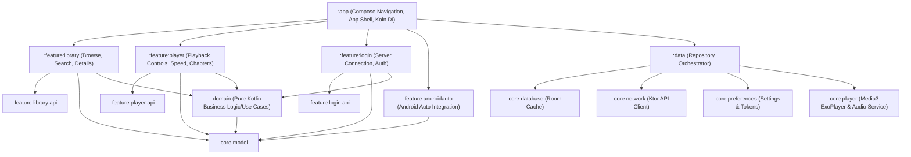

# ABS Client App

An Android client for [Audiobookshelf](https://www.audiobookshelf.org/), a self-hosted audiobook and podcast server. Built with Kotlin, Jetpack Compose, and modern Android development best practices.

---

## 📱 Features & Highlights

- **Seamless Synchronization:** Automatically and transparently synchronizes media playback progress, finished statuses, and reading positions with the Audiobookshelf server.
- **Offline-First Resilience:** Cached library metadata, database records, and downloaded audio tracks allow uninterrupted playback and offline operation.
- **Dynamic Host & Robust Login:** Supports custom domains, local IPs, reverse proxies, and custom ports.
- **Stable Background Playback:** Reliable, long-running audio playback sessions leveraging Media3, preventing termination when the screen is off or when the app is backgrounded.
- **Responsive Multi-Device Layouts:**
  - **Phone:** Tailored touch layouts, portrait orientation support, and notification playback controls.
  - **Tablet:** Expanded multi-pane screens utilizing extra screen real estate.
  - **Desktop (Chromebooks):** Window resizing support and keyboard navigation.
  - **Android Auto:** Driver-safe media template layout featuring large touch targets.

---

## 🛠️ Architecture & Tech Stack

This project follows **Clean Architecture** principles with a strict separation of concerns, organized into a decoupled **Multi-Module Gradle Architecture**:



### Module Breakdown

| Module | Description |
| :--- | :--- |
| **`:app`** | Application entry point, main activity, Compose navigation routing, global theme styling, and Koin dependency injection configuration. |
| **`:feature:login`** | Login flows, server connection normalization, and credentials authentication (`:api` / `:impl`). |
| **`:feature:library`** | Library browsing lists, book details, and search functionality (`:api` / `:impl`). |
| **`:feature:player`** | Audiobook player controls, sleep timer, chapters bottom sheet, and speed selector (`:api` / `:impl`). |
| **`:feature:androidauto`** | Android Auto media session delegation, content browser trees, and driving-optimized interfaces. |
| **`:domain`** | Pure-Kotlin business logic, domain use cases, and repository interfaces (independent of the Android platform). |
| **`:data`** | Repository implementations coordinating caching, networking, downloads, and playback progress syncing. |
| **`:core:model`** | Domain models (e.g., `Book`, `Library`, `Chapter`) and business utilities. |
| **`:core:preferences`** | Key-value settings persistence using `SharedPreferences` (`PreferencesManager`). |
| **`:core:database`** | Room local database (`abs_client_db`) and entity definitions caching library metadata. |
| **`:core:network`** | Ktor HTTP client configuration (`AudiobookshelfRemoteDataSource`) and JSON serialization/deserialization DTOs. |
| **`:core:player`** | Media3 ExoPlayer orchestration, `AudiobookPlayerService` background service, and `PlayerManager`. |

### Tech Stack Details

- **UI & Navigation:** Jetpack Compose with Material Design 3 and AndroidX Navigation 3.
- **Dependency Injection:** Koin for Android and Jetpack Compose.
- **Networking:** Ktor Client with `kotlinx.serialization` (JSON parsing).
- **Local Persistence:** SQLite Database using Room (Metadata, playback progress, download queues).
- **Preferences:** Android SharedPreferences (`abs_client_prefs`) for runtime configurations.
- **Media Playback:** Android Media3 (ExoPlayer and MediaSession).
- **Image Loading:** Coil (`io.coil-kt:coil-compose`) for cover art loading and cache coordination.

---

## 🚀 Getting Started

### Prerequisites

- **JDK 17** or higher
- **Android SDK** (Compile & Target SDK: `36`, Minimum SDK: `26`)
- **Android Studio** (Koala or newer recommended)

### Build Instructions

To build the application, execute the following commands from the project root:

```bash
# Build the project
./gradlew build

# Run unit tests
./gradlew test

# Install the debug build to a connected device/emulator
./gradlew installDebug
```

---

## 📖 Specifications Reference

For deep-dive documentation on specific aspects of the codebase:
- High-level design and success metrics: See [specs/project_spec.md](file:///home/hansenji/src/abs-client-app/specs/project_spec.md)
- Persistent SQLite schemas and SharedPrefs rules: See [specs/local_source_spec.md](file:///home/hansenji/src/abs-client-app/specs/local_source_spec.md)
- Settings & Speed Sync behavioral specifications: See [specs/settings_spec.md](file:///home/hansenji/src/abs-client-app/specs/settings_spec.md)
