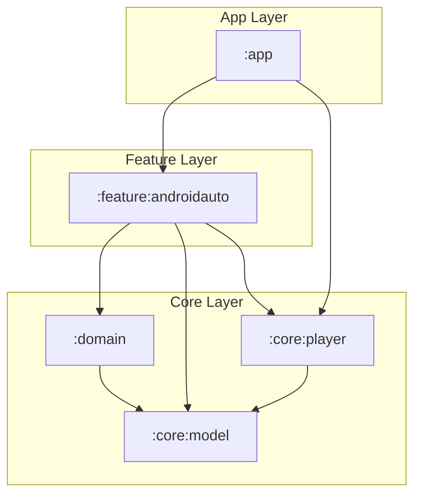

# Core Specification: Media Session Callbacks & Control

This document defines the behavioral specifications, custom session commands, and platform integrations for the Media3 playback session callback engine.

---

## 1. Context & Architecture

To avoid circular dependencies between feature-level browsing components and the core playback service, all playback actions are decoupled and handled in the `:core:player` module. 

- **`AudiobookSessionCallback`**: Extends Media3's `MediaSession.Callback` (or `MediaLibrarySession.Callback` base functions).
- **Service Integration**: The callback is instantiated and attached to the `MediaSession` inside `AudiobookPlayerService`.
- **Target Interface**: Controls map directly to the `PlayerManager` API which encapsulates standard `ExoPlayer` controls.
- **Settings Hook**: Custom command durations and speeds are read from and persisted to the `SettingsRepository`.

---

## 2. Playback Command Specifications

### A. Standard Media3 Operations
- **Play / Pause**: Invokes `PlayerManager.play()` and `PlayerManager.pause()` respectively.
- **Seek To**: Receives a `positionMs` value and seeks using `PlayerManager.seekTo(positionMs)`.

### B. Custom Action Commands
The callback intercepts and executes the following custom Media3 commands (`SessionCommand`):

#### 1. Skip Forward (`COMMAND_SKIP_FORWARD`)
- **Action**: Seeks forward by the user's preferred duration.
- **Rules**:
  1. Retrieve duration in seconds via `SettingsRepository.getSkipForwardDuration()` (defaults to `30`).
  2. Compute new position: `currentPosition + (duration * 1000)`.
  3. If new position exceeds the total audiobook duration, seek to the end of the book and pause playback.

#### 2. Skip Backward (`COMMAND_SKIP_BACKWARD`)
- **Action**: Seeks backward by the user's preferred duration.
- **Rules**:
  1. Retrieve duration in seconds via `SettingsRepository.getSkipBackwardDuration()` (defaults to `10`).
  2. Compute new position: `currentPosition - (duration * 1000)`.
  3. If new position is less than `0`, seek to `0` and do not change play/pause state.

#### 3. Cycle Playback Speed (`COMMAND_CYCLE_SPEED`)
- **Action**: Cycles the playback speed.
- **Rules**:
  1. Cycle current speed among: `0.5x -> 0.75x -> 1.0x -> 1.25x -> 1.5x -> 1.75x -> 2.0x -> 2.25x -> 2.5x -> 2.75x -> 3.0x -> 0.5x`.
  2. Update the speed on the active player engine immediately.
  3. Save the chosen speed to preferences via `SettingsRepository.savePlaybackSpeed(speed: Float)`.

#### 4. Skip to Next Chapter (`COMMAND_SKIP_TO_NEXT_CHAPTER`)
- **Action**: Skips to the subsequent chapter.
- **Rules**:
  1. Determine current absolute position and query active book chapter list.
  2. If a subsequent chapter exists, seek to its start timestamp.
  3. If on the final chapter, do nothing or seek to the end of the book.

#### 5. Skip to Previous Chapter (`COMMAND_SKIP_TO_PREVIOUS_CHAPTER`)
- **Action**: Restarts or jumps to the preceding chapter.
- **Rules**:
  1. Determine current absolute position and active chapter start timestamp.
  2. **Chapter Restart Threshold**: If the current chapter has been playing for more than `5` seconds, seek to the start of the current chapter.
  3. **Jump to Prior Chapter**: If the current chapter has been playing for `5` seconds or less, seek to the start of the previous chapter.
  4. If there is no previous chapter, seek to the beginning of the book (`0.0s`).

### C. Voice Search & Playback Resumption (`onAddMediaItems`)

When Google Assistant, Android Auto, or another media controller invokes voice commands, the requests are routed through the session callback's `onAddMediaItems` method. The app must handle these requests as follows:

#### 1. Checking Search Intent
- Query `MediaItem.requestMetadata.searchQuery` from the requested list of media items.
- If a query or specific intent is present, trigger search resolution.

#### 2. Generic Resumption ("Continue Reading", "Pickup Where I Left Off")
- **Trigger**: The search query is empty, null, or contains generic terms (e.g., `"audiobook"`, `"book"`, `"continue reading"`, `"resume"`).
- **Execution Rules**:
  1. Query the database/repository for the user's active in-progress audiobooks (checking the `playback_progress` table where `progress > 0.0f` and `progress < 1.0f`).
  2. Sort results by `lastUpdated` descending to locate the most recently played audiobook.
  3. Construct a playable `MediaItem` representing the active book. Include the saved playback progress (`currentTime`) in its initialization.
  4. Return the playable `MediaItem` to start playback immediately from the saved position.
  5. If no active audiobook is found, fall back to the first downloaded book, or return an empty list with an appropriate error state.

#### 3. Specific Content Search ("Play [Book Title]")
- **Trigger**: The search query contains specific terms (e.g., `"play The Hobbit"`).
- **Execution Rules**:
  1. Query the local cache or server search endpoint for books matching the search query terms (checking titles and authors).
  2. If a single match is found, construct its playable `MediaItem`. If it has progress stored in the database, set the start position to the saved progress `currentTime`.
  3. If multiple matches are found, return the most relevant result (highest match score or most recently accessed).
  4. Return the resolved `MediaItem` to start playback.

---

## 3. Contextual Architecture & Module Relationships

To support optional features like Android Auto while maintaining a strict modular dependency structure (preventing feature modules from introducing circular dependencies into `:core:player`), a layered callback delegation design is used.

### Module Relationships
- **`:feature:androidauto`**: Implements `AndroidAutoBrowseCallback` (extending `MediaLibrarySession.Callback`). Depends on `:core:player` to delegate player session controls, and `:domain` for content queries.
- **`:core:player`**: Implements `AudiobookSessionCallback` (extending `MediaLibrarySession.Callback`) to handle standard/custom controls. It has no dependencies on feature modules.



---

## 4. Dependency Injection Configuration

Dependency Injection coordinates callback overrides via Koin modules resolved inside the `:app` entry point.

### A. Core Player Module (`:core:player`)
Declares the base `AudiobookSessionCallback` and binds it as the default implementation of `MediaLibrarySession.Callback`:
```kotlin
val corePlayerModule = module {
    single {
        AudiobookSessionCallback(
            context = androidContext(),
            playerManager = get(),
            settingsRepository = get(),
            getBooksUseCase = get(),
            getPlaybackProgressUseCase = get()
        )
    }

    single<MediaLibrarySession.Callback> {
        get<AudiobookSessionCallback>()
    }
}
```

### B. Android Auto Module (`:feature:androidauto`)
If present in the dependency tree, it overrides the `MediaLibrarySession.Callback` registration, decorating it with `AndroidAutoBrowseCallback` and injecting the base `AudiobookSessionCallback` as its delegation target:
```kotlin
val featureAndroidAutoModule = module {
    single<MediaLibrarySession.Callback> {
        AndroidAutoBrowseCallback(
            context = androidContext(),
            settingsRepository = get(),
            getBooksUseCase = get(),
            getPlaybackProgressUseCase = get(),
            coreCallback = get()
        )
    }
}
```

### C. Service Binding (`:core:player`)
`AudiobookPlayerService` injects the registered `MediaLibrarySession.Callback`. Due to Koin module loading order in the `:app` module, this resolves to `AndroidAutoBrowseCallback` if the Android Auto feature is present, and falls back to `AudiobookSessionCallback` otherwise:
```kotlin
class AudiobookPlayerService : MediaLibraryService() {
    private val player: Player by inject()
    private val sessionCallback: MediaLibrarySession.Callback by inject()
    private var mediaLibrarySession: MediaLibrarySession? = null

    override fun onCreate() {
        super.onCreate()
        
        mediaLibrarySession = MediaLibrarySession.Builder(
            this,
            player,
            sessionCallback
        ).build()
    }
}
```
