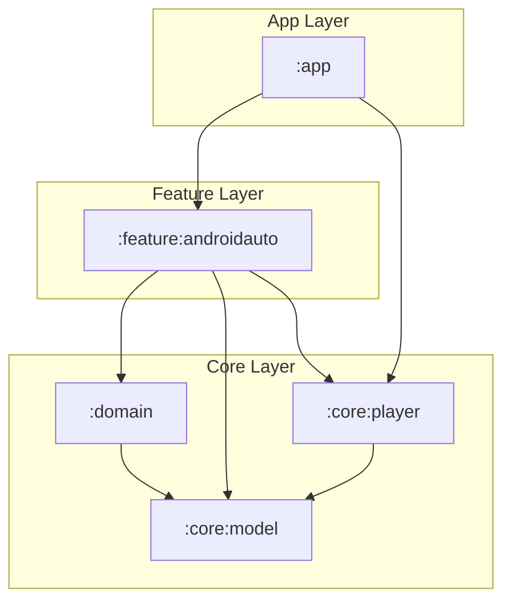

# Feature Specification: Android Auto Integration

This document defines the requirements, architecture, and behavioral specifications for adding Android Auto support to the ABS Client App. This feature allows users to browse their audiobook library, resume playback of in-progress books, and control playback directly from their vehicle's dashboard.

---

## 1. Feature Context & Constraints

Android Auto media applications do not run custom visual user interfaces. Instead, they project a standard template-based UI provided by the Android Auto platform. To interface with Android Auto, the app must expose its media library and playback controls via Android **Media3's MediaSession / MediaLibraryService APIs**.

### Constraints
- **Driver Safety**: The user interface is template-driven, optimized for quick interactions with large tap targets, and enforces strict limits on list scrolling depth.
- **Module Structure**: Implemented as a single `:feature:androidauto` module.
- **Layered Delegation (Decoupling)**: 
  - To avoid circular dependencies and ensure that lock screen notifications and Bluetooth controllers work without loading the car module, **playback session callbacks** are handled in `:core:player`.
  - `:feature:androidauto` is responsible *only* for the **content browsing tree** and delegates playback controller command intercepts directly down to the core player callback.

---

## 2. Specific Behavioral Rules

### A. Media Browsing Structure (Content Tree)

Android Auto queries the `MediaLibraryService` using parent IDs to build a hierarchical content tree. The tree must support the following structure:

```
[Root]
 ├── Continue Listening (Browsable)
 │    ├── Book A (Playable)
 │    └── Book B (Playable)
 ├── Downloads (Browsable)
 │    ├── Book C (Playable)
 │    └── Book D (Playable)
 └── All Audiobooks (Browsable)
      ├── By Author (Browsable)
      │    ├── Author X (Browsable)
      │    │    └── Book A (Playable)
      │    └── Author Y (Browsable)
      │         └── Book B (Playable)
      └── A-Z (Browsable)
           ├── A (Browsable)
           │    └── Book A (Playable)
           ├── B (Browsable)
           │    └── Book B (Playable)
           └── ...
```

#### Media Item Attributes
- **Root node**: ID `"root"`, must return the top-level categories (Continue Listening, Downloads, All Audiobooks) as browsable media items.
- **Category nodes**:
  - **Continue Listening** (`"continue_listening"`): Query the repository for books with progress `> 0%` and `< 99%` (or not marked finished), sorted by `lastUpdated` descending.
  - **Downloads** (`"downloads"`): Query the database/repository for books where `isDownloaded == true`. This folder must remain fully functional when the app is offline.
  - **All Audiobooks** (`"all_audiobooks"`): Under this Level 1 category, show two Level 2 subcategories:
    - **By Author** (`"by_author"`): Level 3 is the list of authors; Level 4 is the playable books by that author.
    - **A-Z** (`"a_z"`): Level 3 is the starting letters (A, B, C, etc.); Level 4 is the playable books whose titles start with that letter.
- **Leaf nodes (Audiobooks)**:
  - Must represent the `Book` domain entity.
  - Set `MediaMetadata.MEDIA_TYPE_AUDIO_BOOK_CHAPTER` or `MEDIA_TYPE_PLAYLIST`.
  - Set `isPlayable = true` and `isBrowsable = false`.
  - Display the cover artwork, title, and author/narrator in metadata.
  - **Dynamic Cover Art Loading**:
    - Request cover art dynamically using the server's cover endpoint: `/api/items/{id}/cover`.
    - Retrieve local cache first (`coverPath` in the SQLite `books` table) to support offline rendering.
    - If the remote query fails, or the device is offline and the cover is not cached, fall back to a local vector asset drawable (`ic_book_placeholder`).

### B. Media Session & Playback Controls Layout

Android Auto uses the Media3 `MediaLibraryService` templates to render the playback screen. The controls must be organized as follows:

#### 1. Controls Arrangement
- **Primary Controls (Main Playback Row)**:
  - **Play / Pause**: Standard play/pause toggling.
  - **Skip Backward**: Seeks backward by the user-defined duration. Maps to the standard "Previous" button if the book has no chapters, or to a custom action command button.
  - **Skip Forward**: Seeks forward by the user-defined duration. Maps to the standard "Next" button if the book has no chapters, or to a custom action command button.
- **Secondary Controls (Overflow Menu)**:
  - **Playback Speed**: A custom action command button that cycles through playback speeds (`0.5x` to `3.0x` in `0.25x` steps).
  - **Skip to Previous Chapter**: Skips to the previous chapter. Only displayed when chapter metadata is available.
  - **Skip to Next Chapter**: Skips to the next chapter. Only displayed when chapter metadata is available.

#### 2. Callback Delegation Mechanism
- **AndroidAutoBrowseCallback**: The `MediaLibrarySession.Callback` implementation in `:feature:androidauto` handles browsing queries (`onGetLibraryRoot`, `onGetChildren`, `onGetItem`).
- **Control Delegation**: 
  - To prevent circular dependencies and ensure a single playback engine, `AndroidAutoBrowseCallback` delegates all playback-related callbacks (such as `onConnect`, `onCustomCommand`, `onAddMediaItems`, `onSetPlaybackSpeed`) directly to `AudiobookSessionCallback` located in `:core:player`.

### C. Authentication & Error Handling

- **Logged Out State**: If no server configuration or authentication token exists, the root node should return a single browsable media item with a title indicating "Please log in on your phone" and playability set to `false`.
- **Empty States**: If a category (e.g., "Downloads") is empty, return an empty list. Android Auto will display a standard empty state message.
- **Offline Mode**: When the device is offline, filter **all** categories (including "Continue Listening" and "All Audiobooks") to only show downloaded books, ensuring every visible item can be played immediately.

---

## 3. Proposed Architectural Changes

### Module Relationships
- **`:feature:androidauto`**: Implements `AndroidAutoBrowseCallback` (extending `MediaLibrarySession.Callback`). Depends on `:core:player` to delegate player session controls, and `:domain` for content queries.
- **`:core:player`**: Implements `AudiobookSessionCallback` (extending `MediaSession.Callback`) to handle standard/custom controls. It has no dependencies on feature modules.



### Dependency Setup (Koin Injection)
1. **Define a Koin Module in `:feature:androidauto`**:
   ```kotlin
   val featureAndroidAutoModule = module {
       single<MediaLibrarySession.Callback> {
           AndroidAutoBrowseCallback(
               getBooksUseCase = get(),
               getPlaybackProgressUseCase = get(),
               coreCallback = get() // Injected from :core:player
           )
       }
   }
   ```
2. **Setup in `AudiobookPlayerService` (`:core:player`)**:
   ```kotlin
   class AudiobookPlayerService : MediaLibraryService() {
       private val exoPlayer: ExoPlayer by inject()
       // Injected callback: binds to AndroidAutoBrowseCallback if available,
       // otherwise falls back to the base AudiobookSessionCallback.
       private val sessionCallback: MediaLibrarySession.Callback by inject()
       private var mediaLibrarySession: MediaLibrarySession? = null

       override fun onCreate() {
           super.onCreate()
           mediaLibrarySession = MediaLibrarySession.Builder(
               this,
               exoPlayer,
               sessionCallback
           ).build()
       }
   }
   ```

---

## 4. Verification Plan

### Automated / Integration Tests
- **Callback Unit Tests**: Verify that `AndroidAutoBrowseCallback` constructs the correct browse items based on mock server states.
- **Delegation Tests**: Verify that calling non-browsing callbacks on `AndroidAutoBrowseCallback` successfully forwards the commands to `AudiobookSessionCallback`.

### Manual Verification
- **Desktop Head Unit (DHU)**: Use the Android Auto Desktop Head Unit to verify:
  1. The app appears in the Android Auto launcher.
  2. The browse tree behaves correctly.
  3. Clicking a book loads player UI and triggers media session callbacks.
