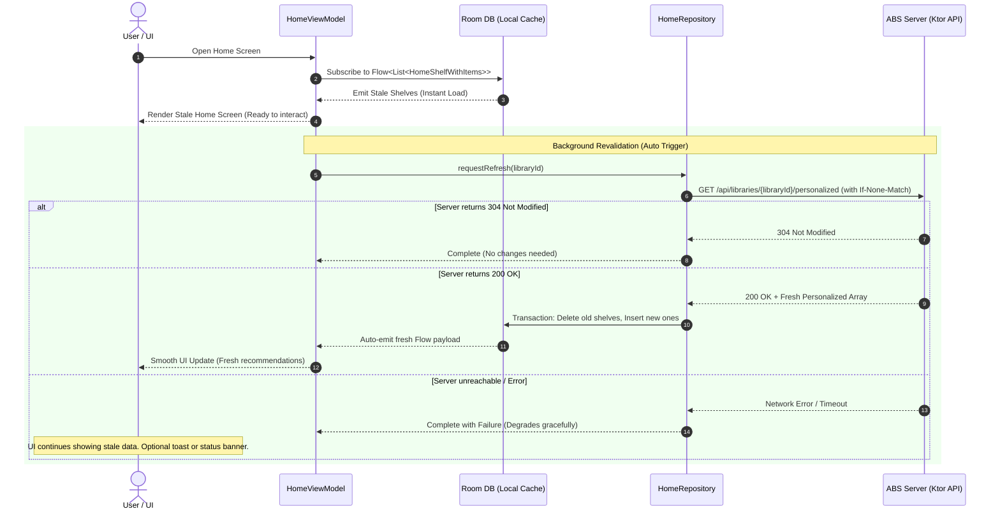

# Feature Specification: Home Screen & Personalized Shelves

This document defines the requirements, data structures, network API integration, offline caching behavior, and presentation layouts for the **Home Screen** feature within the ABS Client App project.

---

## 1. Feature Context & Constraints

The **Home Screen** serves as the personalized landing experience for users upon logging in. It aggregates listening progress, recommendations, recent additions, and content categories specific to the selected library.

### Architectural Data Flow
Personalized content streams through these architectural boundaries:
- **`:core:network`**: Communicates with the Audiobookshelf server using Ktor, fetching polymorphic shelves from `/api/libraries/{libraryId}/personalized`.
- **`:data`**: Implements a repository layer coordinating network retrievals and providing clean fallbacks when offline or on network failure.
- **`:domain`**: Implements use cases (e.g. `GetPersonalizedShelvesUseCase`) to isolate business logic.
- **`:feature:home`**: Presentation layer containing `HomeViewModel`, `HomeScreen` composable, shelf sub-composables, and UI state models.

---

## 2. API Integration & Data Models

The Home Screen relies on the server's personalized library endpoint to fetch lists of items grouped into shelves.

### A. Network Endpoint
*   **Request URL**: `GET /api/libraries/{libraryId}/personalized`
*   **Query Parameters**:
    - `minified`: `1` (returns compact entities containing only crucial metadata)
    - `include`: `rssfeed,numEpisodesIncomplete` (incorporates podcast metrics)
*   **Headers**:
    - `Authorization: Bearer <token>`
    - `If-None-Match: <etag>` (for conditional caching)
*   **Response Headers**:
    - `ETag: <etag>` (returned with `200 OK`)

### B. Polymorphic Data Schema
The server returns an array of shelves representing different content types (books, authors, series, episodes, podcasts). The response is parsed polymorphically using Kotlin Serialization:

```kotlin
@Serializable
sealed interface NetworkLibraryShelf {
    val id: String
    val label: String
    val total: Int
    val type: String
}

@Serializable
@SerialName("book")
data class NetworkBookShelf(
    override val id: String,
    override val label: String,
    override val total: Int,
    override val type: String,
    val entities: List<LibraryItem>
) : NetworkLibraryShelf

@Serializable
@SerialName("podcast")
data class NetworkPodcastShelf(
    override val id: String,
    override val label: String,
    override val total: Int,
    override val type: String,
    val entities: List<LibraryItem>
) : NetworkLibraryShelf

@Serializable
@SerialName("episode")
data class NetworkEpisodeShelf(
    override val id: String,
    override val label: String,
    override val total: Int,
    override val type: String,
    val entities: List<LibraryItem> // Contains recentEpisode field inside LibraryItem
) : NetworkLibraryShelf

@Serializable
@SerialName("series")
data class NetworkSeriesShelf(
    override val id: String,
    override val label: String,
    override val total: Int,
    override val type: String,
    val entities: List<NetworkSeriesItem>
) : NetworkLibraryShelf

@Serializable
@SerialName("authors")
data class NetworkAuthorShelf(
    override val id: String,
    override val label: String,
    override val total: Int,
    override val type: String,
    val entities: List<NetworkAuthorItem>
) : NetworkLibraryShelf
```

Where:
- `LibraryItem` maps to the existing `:core:network` model representing a book or podcast.
- `NetworkSeriesItem` represents a series: contains `id`, `name`, and optionally a list of books.
- `NetworkAuthorItem` represents an author: contains `id`, `name`, and `coverPath`.

## 3. Caching, Database Persistence, & Stale-While-Revalidate

To support instant app load times and full offline browsing, the Home Screen is backed by local database tables inside the Room cache. The application uses a **Stale-While-Revalidate** strategy: it immediately displays stale cached content from the database on launch, then updates the UI once fresh data is fetched from the server.

### A. Database Schema (Room Entities)
The local database stores shelves and their items in two related tables inside the `:core:database` module.

#### 1. Home Shelf Entity (`home_shelves` Table)
```kotlin
@Entity(tableName = "home_shelves")
data class HomeShelfEntity(
    @PrimaryKey val id: String,
    val libraryId: String,
    val label: String,
    val total: Int,
    val type: String,          // Discriminator: "book", "series", "authors", "episode", "podcast"
    val verticalSortOrder: Int // Order in which the shelf is rendered vertically
)
```

#### 2. Home Shelf Item Entity (`home_shelf_items` Table)
```kotlin
@Entity(
    tableName = "home_shelf_items",
    foreignKeys = [
        ForeignKey(
            entity = HomeShelfEntity::class,
            parentColumns = ["id"],
            childColumns = ["shelfId"],
            onDelete = ForeignKey.CASCADE
        )
    ]
)
data class HomeShelfItemEntity(
    @PrimaryKey val compositeId: String, // Constructed as "${shelfId}_${entityId}"
    val shelfId: String,
    val entityId: String,                // ID of Book, Series, Author, or Podcast
    val title: String?,                  // Cached title for instant display
    val subtitle: String?,               // Cached subtitle/author/info text
    val imageUrl: String?,               // Cover image URL or relative path
    val horizontalIndex: Int,            // Order of the item in the horizontal row
    val additionalData: String?          // Serialized JSON for specialized elements (e.g. podcast episode meta, sequence data)
)
```

#### 3. Relations Model (`HomeShelfWithItems`)
```kotlin
data class HomeShelfWithItems(
    @Embedded val shelf: HomeShelfEntity,
    @Relation(
        parentColumn = "id",
        entityColumn = "shelfId"
    )
    val items: List<HomeShelfItemEntity>
)
```

---

### B. Stale-While-Revalidate Workflow
The lifecycle of loading and rendering the Home Screen follows this state machine:



#### Detailed Operations:
1. **Instant Loading**: When `HomeScreen` opens, the view model loads cached shelves for the selected `libraryId` instantly from the DB. If no database record exists, the UI shows a shimmering/loading skeleton.
2. **Background Sync**: Immediately after launching, the repository performs a background network request.
3. **Cache Synchronization (Upsert Transaction)**:
   - On success (`200 OK`), the repository runs a Room `@Transaction` to delete old `home_shelves` and `home_shelf_items` entries for the selected `libraryId`, and inserts the newly fetched shelves.
   - Using Room's reactive `Flow` emissions, the database mutation triggers the VM to emit a fresh state, causing Compose to redraw the rows dynamically.
4. **Conditional Requests**: Requests send the last stored ETag. If the server returns `304 Not Modified`, database writes are bypassed, saving processor cycles and reducing battery drain.
5. **Fallback on Failure**: If the network is down, the background sync fails silently or displays a temporary "offline" banner, while the user continues to browse the fully interactive stale home page.

---

### C. Offline Dynamic Compilation (Local Shelf Fallbacks)
If the user logs in for the first time while offline, or if the database is completely empty and no network connection is available, the repository compiles local fallback shelves dynamically. These fallbacks do not overwrite the server-calculated cached shelves but are compiled in-memory as a temporary state:

1. **"Continue Listening (Books)" Shelf** (`local-books-continue`):
   - Query the database for books with local progress `progress > 0f` and `isFinished == false`.
   - Sort by progress `lastUpdated` timestamp descending.
2. **"Continue Listening (Episodes)" Shelf** (`local-episodes-continue`):
   - Query the database for podcast episodes with local progress `progress > 0f` and `isFinished == false`.
   - Sort by progress `lastUpdated` descending.
3. **"Downloaded Books" Shelf** (`local-books`):
   - Query the database for books with `isDownloaded == true`.
   - Sort by `lastUpdated` or alphabetically.
4. **"Downloaded Podcasts" Shelf** (`local-podcasts`):
   - Query the database for podcasts containing downloaded episodes.


---

## 4. UI/UX Design & Layout (Jetpack Compose)

The Home Screen UI follows a dynamic vertical-scrolling stream consisting of horizontal-scrolling rows (a **Lazy Column of Lazy Rows**).

```
+-------------------------------------------------+
| Home                                      (O)   |  <-- Top Bar (Server Info, Settings, Profile)
+-------------------------------------------------+
|                                                 |
|  Continue Listening                             |  <-- Vertical LazyColumn Header
|  +--------+  +--------+  +--------+             |
|  |        |  |        |  |        |             |  <-- Horizontal LazyRow (Book Cards)
|  | Cover  |  | Cover  |  | Cover  |             |
|  +--------+  +--------+  +--------+             |
|                                                 |
|  Recently Added                                 |
|  +--------+  +--------+  +--------+             |
|  |        |  |        |  |        |             |  <-- Horizontal LazyRow (Book Cards)
|  | Cover  |  | Cover  |  | Cover  |             |
|  +--------+  +--------+  +--------+             |
|                                                 |
|  Popular Series                                 |
|  +--------------+  +--------------+             |
|  | Series Name  |  | Series Name  |             |  <-- Horizontal LazyRow (Series Cards)
|  | 3 Books      |  | 5 Books      |             |
|  +--------------+  +--------------+             |
|                                                 |
|  Favorite Authors                               |
|   ( O ) Name        ( O ) Name                  |  <-- Horizontal LazyRow (Author Cards)
|                                                 |
+-------------------------------------------------+
```

### A. State Management Model
To support background revalidation without interrupting active user viewing, the Presentation layer uses a single data class modeling both data and loading states together, rather than mutually exclusive sealed states:

```kotlin
data class HomeUiState(
    val shelves: List<ShelfUiModel> = emptyList(),
    val isLoading: Boolean = false,      // Full-screen loading (first load with no cache)
    val isRefreshing: Boolean = false,   // Background revalidation indicator / Swipe-to-refresh pull state
    val errorMessage: String? = null     // Contains revalidation error or initial load error
)
```

#### UI State Rendering Rules:
1. **Initial Load (DB Empty, Refreshing)**: `isLoading = true, shelves = empty`. UI renders a full-screen shimmer skeleton.
2. **Stale Render (DB Cached, Refreshing)**: `isRefreshing = true, shelves = cachedShelves`. UI instantly renders the cached shelves and displays a subtle top-screen refresh progress bar or spinner.
3. **Load Completed (DB Fresh, Idling)**: `isRefreshing = false, shelves = freshShelves`. UI renders the fresh shelves, removing all loading indicators.
4. **Revalidation Failure (DB Cached, Idle)**: `isRefreshing = false, shelves = cachedShelves, errorMessage = "Failed to sync"`. UI retains the stale content on screen and broadcasts the error via a transient `Snackbar` or message banner (no full-screen error blocking).
5. **Fatal Error (DB Empty, Idle)**: `isLoading = false, shelves = empty, errorMessage = "Connection failed"`. UI renders a full-screen error screen with a "Retry" button.

### B. Main Layout & Swipe to Refresh
The main layout is enclosed within a Material 3 **`PullToRefreshBox`** (or the modifier-based `pullToRefresh` container) to support manual swipe-to-refresh:

- **Swipe-to-Refresh Gesture**:
  - Pulling down on the screen triggers `HomeViewModel.refresh(force = true)`.
  - The VM bypasses local ETag header checks (omits `If-None-Match`), forcing a fresh fetch from the server.
  - The refreshing indicator state is bound directly to `HomeUiState.isRefreshing`.
- **Vertical Stream Layout**:
  - Inside the pull-to-refresh container, a parent `LazyColumn` handles vertical scrolling.
  - **Header**: Top app bar showing the active library name and selection dropdown.
  - **Items**: A loop traversing the list of available shelves. Each item in the `LazyColumn` renders a single Shelf component.

### C. Shelf Component (LazyRow Wrapper)
Each shelf renders:
1. **Title / Header Row**:
   - Displays the shelf label (e.g. "Continue Listening", "Recently Added", "Recommended").
   - Shows a "View All" or arrow indicator if the total count exceeds the default display count.
2. **LazyRow Container**:
   - `contentPadding` of `16.dp` at start and end for alignment with screen edges.
   - `horizontalArrangement = Arrangement.spacedBy(12.dp)` for consistent spacing.


### C. Shelf Item Components (Card Variants)
Within the `LazyRow`, elements are rendered dynamically based on the shelf type:

#### 1. Book / Podcast Card (`type == "book"` or `type == "podcast"`)
- **Dimensions**: Aspect ratio `1:1` (square) or `1:1.6` based on library settings. Default size: `120.dp` width.
- **Visuals**: Cover art loaded via Coil (with authorization headers), rounded corners (`8.dp`), elevation/card container.
- **Metadata**: Title (single line, ellipsis) and author (single line, muted text) placed beneath the cover.
- **Badges**:
  - **Read Badge**: Checkmark icon in top-left corner if progress is completed.
  - **Download Badge**: Pin/downloaded icon in top-right corner if cached offline.
  - **Progress Bar**: Thin linear progress indicator layered at the bottom edge of the cover image.

#### 2. Episode Card (`type == "episode"`)
- Displays podcast cover alongside detail text.
- Text indicates: Episode title, release/publication date, and remaining duration.
- Visual progress bar overlay on the episode thumbnail.

#### 3. Series Card (`type == "series"`)
- **Dimensions**: Double-width format (`200.dp` width) to accommodate list details.
- **Visuals**: Displays stacked book covers or a stylized banner card.
- **Text**: Series name, sequence info, and total count of books in the series (e.g., "5 Books").

#### 4. Author Card (`type == "authors"`)
- **Dimensions**: Avatar format (`90.dp` width).
- **Visuals**: Circular profile image loaded via Coil, with a placeholder profile icon fallback.
- **Text**: Author's name centered below the avatar.

### D. Animations & Interaction Polish
- **Loading State**: Displays skeleton shimmers (`shimmerEffect` modifier) mirroring the rows and card ratios while fetching data.
- **Press State**: Subtle micro-scale interaction (`animateFloatAsState` mapping to `scaleX` and `scaleY`) when a card is tapped, giving tactile feedback.
- **Transitions**: Smooth fade-in (`AnimatedVisibility`) when switching libraries or fetching content completes.

---

## 5. Navigation & Integration

### A. Navigation Configuration
The Home Screen navigation keys are housed in a new `:feature:home:api` module:

```kotlin
package dev.vikingsen.absclientapp.feature.home.api

import androidx.navigation3.runtime.NavKey
import kotlinx.serialization.Serializable

@Serializable
data object Home : NavKey
```

### B. Main Navigation Integration
1. Update `MainViewModel` to set `startDestination` to `Home` when authenticated:
   ```kotlin
   val startDestination: NavKey
       get() = if (preferencesManager.isLoggedIn()) Home else Login
   ```
2. Register the Home Screen route in `:app` module `Navigation.kt`:
   ```kotlin
   entry<Home> {
       HomeScreen(
           onBookClick = { bookId -> backStack.add(Detail(bookId)) },
           onLibraryClick = { backStack.add(Library) }, // Allow navigation to full library grid
           onLogout = { backStack.add(Login) }
       )
   }
   ```

---

## 6. Verification & Quality Plan

Verification ensures the performance metrics of the project specification are upheld:
- **Load Performance**: Personalized shelves must load instantly from the local database cache upon opening the screen (under `100ms` target) to show the stale content, with background revalidation completing seamlessly.
- **Layout Responsiveness**: Scroll velocity must remain stutter-free (no frame drops) during vertical and horizontal list browsing.
- **Offline Transition**: Toggling airplane mode must instantly switch the UI to locally compiled shelves (Continue Listening, Downloaded) in under `300ms` without raising network errors or app crashes.
