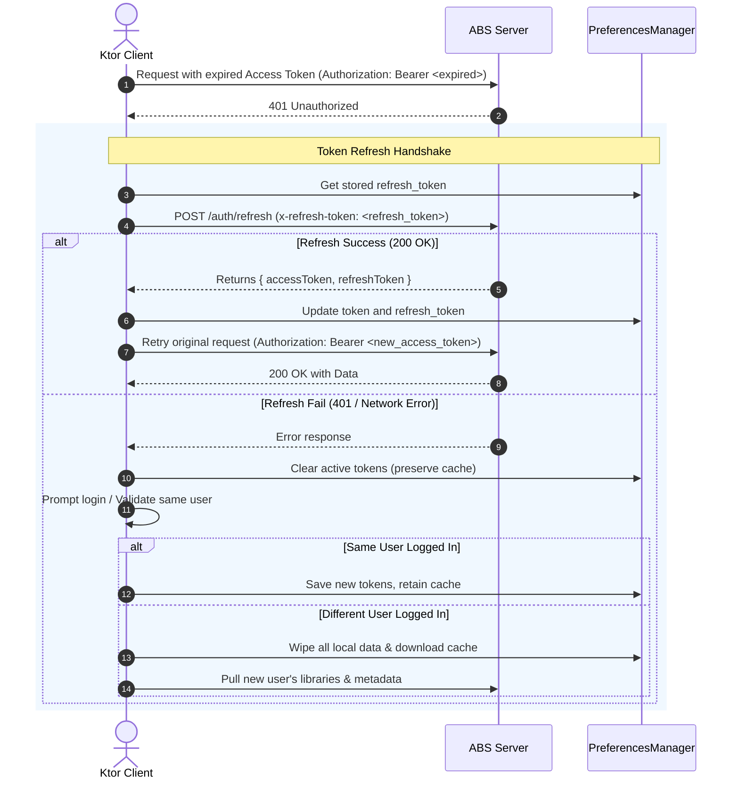

# Specification: Client Authentication & Token Refresh Flow

This specification defines the authentication mechanism, storage requirements, request authorization, and token renewal behaviors for the Skald, aligning with the server's session requirements.

---

## 1. Overview & Protocol Design

The application uses a token-based authentication mechanism. To minimize network traffic and secure user sessions:
- The app logs in using credentials to acquire both an **Access Token** (JWT) and a **Refresh Token**.
- All subsequent `/api/...` requests are authenticated using a standard OAuth Bearer token scheme.
- When the Access Token expires, the client automatically handles renewal using the Refresh Token.

---

## 2. Authentication Flow (Login)

When the user logs in, the app submits credentials to the server.

*   **Endpoint**: `POST /login`

### Request Headers
```http
Content-Type: application/json
x-return-tokens: true
```
> [!IMPORTANT]
> The `x-return-tokens: true` header is critical. It instructs the Audiobookshelf server to return both the `accessToken` and `refreshToken` properties in the JSON response body.

### Request Body
```json
{
  "username": "user_username",
  "password": "user_password"
}
```

### Response Body
On a successful `200 OK` response, the server returns the tokens on the nested `user` object:
```json
{
  "user": {
    "id": "user_id_uuid",
    "username": "user_username",
    "token": "access_token_jwt",
    "accessToken": "access_token_jwt",
    "refreshToken": "refresh_token_string"
  }
}
```

---

## 3. Persistent Token Storage (Encrypted DataStore)

Once retrieved, the tokens must be saved locally using a secure, encrypted storage mechanism.

- **Library**: `androidx.datastore:datastore-tink:1.3.0-alpha07` (or newer)
- **Encryption Primitive**: Tink's **AEAD (Authenticated Encryption with Associated Data)** via `AeadSerializer` wrapping a Kotlin Serialization (or Proto) serializer.
- **Storage Location**: Managed via `PreferencesManager`, backed by an encrypted file `secure_tokens.pb`.
- **Data Model Schema**:
  ```kotlin
  @Serializable
  data class SecureTokens(
      val accessToken: String? = null,
      val refreshToken: String? = null
  )
  ```

### Gradle Dependency
Include the Tink DataStore integration in your Gradle dependencies:
```kotlin
dependencies {
    implementation("androidx.datastore:datastore-tink:1.3.0-alpha07")
}
```

### Encrypted DataStore Setup
1. **Initialize Tink Keys**: Securely load or generate the Tink Keyset using `AndroidKeysetManager` backed by the Android Keystore.
2. **Wrap Serializer**: Wrap your Kotlin Serialization serializer with `AeadSerializer`.
3. **Build Instance**: Create the DataStore using `DataStoreFactory.create()`.

```kotlin
// 1. Retrieve the secure Keyset and AEAD primitive
val keysetHandle = AndroidKeysetManager.Builder()
    .withSharedPref(context, "datastore_keyset_prefs", "datastore_keyset")
    .withKeyTemplate(KeyTemplate.createFrom(PredefinedAeadParameters.AES256_GCM))
    .withMasterKeyUri("android-keystore://skald_datastore_master_key")
    .build()
    .keysetHandle

val aead = keysetHandle.getPrimitive(RegistryConfiguration.get(), Aead::class.java)

// 2. Wrap the JSON/Proto serializer with Tink encryption
val secureSerializer = AeadSerializer(
    aead = aead,
    wrappedSerializer = SecureTokensSerializer, // Custom Serializer<SecureTokens>
    associatedData = "skald_auth_tokens".encodeToByteArray()
)

// 3. Create the data store instance
val secureDataStore = DataStoreFactory.create(
    serializer = secureSerializer,
    produceFile = { context.dataStoreFile("secure_tokens.pb") }
)
```

### 3.1 Token Expiration Validation (JWT Claims Parsing)

Both the Access Token and the Refresh Token are standard JSON Web Tokens (JWTs). The client can parse their payloads locally to inspect their expiration times without making network requests:

1. **JWT Structure**:
   A JWT consists of three parts separated by dots: `header.payload.signature`. The `payload` (second segment) is Base64Url-encoded and contains JSON claims:
   ```json
   {
     "sub": "user_uuid",
     "username": "user_username",
     "exp": 1716988800, // Expiration time (Unix epoch in seconds)
     "iat": 1716945600  // Issued-at time (Unix epoch in seconds)
   }
   ```

2. **Proactive Access Token Renewal**:
   Before making an API call, the Ktor client or repository should parse the Access Token's `exp` and `iat` claims:
   - Calculate the token's total lifespan: `lifespan = exp - iat`
   - Calculate the 5% preemptive back-off threshold: `threshold = exp - (lifespan * 0.05)`
   - If the current time is within 5% of the expiration time (i.e., `currentTimeSeconds >= threshold`), the token is treated as expired.
   - The request is paused, a token refresh handshake is triggered, and the request is resumed with the newly issued token.

3. **Session Expiry (Refresh Token Validation)**:
   The Refresh Token also carries an `exp` claim representing the absolute session lifetime:
   - If `currentTimeSeconds >= refresh_token_exp`, the session has fully expired.
   - The app must skip the `/auth/refresh` attempt, clear the access/refresh tokens in the secure DataStore, and prompt the user to log in again.
   - **Data Retention & Validation Policy**: The app **must not** immediately wipe the cached databases or downloaded files upon session expiration. Instead, it must prompt the user to re-authenticate and validate if the newly logged-in user matches the previous session:
     - **Same User**: Keep all local databases, playback history, downloaded files, and configurations intact.
     - **Different User**: Wipe all local databases, deleted downloaded tracks, reset preferences, and pull down the library information that the newly logged-in user has access to.

---

## 4. Request Authorization ("OAuth Bearer")

Every outgoing HTTP call to the server API (excluding `/login` and `/ping`) must attach the Access Token.

### Header Format
```http
Authorization: Bearer <access_token>
```

### Implementation (Ktor Interceptor)
The Ktor client uses `AbsApiPlugin` to intercept requests. It retrieves the saved token from `PreferencesManager` and dynamically appends the header:
```kotlin
if (!token.isNullOrEmpty() && !request.headers.contains("Authorization")) {
    request.headers["Authorization"] = "Bearer $token"
}
```

---

## 5. Dual-Layer Token Expiration & Refresh Flow

To ensure high performance (minimizing roundtrip lag) and high reliability (resilience to clock drift and server-side revocation), the application implements a **dual-layer** token handling flow:

### Layer 1: Proactive Preemptive Refresh (Performance Optimization)
Before any request is sent, the client checks if the Access Token is expired or within the **5% back-off threshold** of its expiration window (detailed in Section 3.1). If expired, it triggers a preemptive refresh before dispatching the request.

### Layer 2: Reactive Interceptor (Safety Fallback)
If a request is sent and the server rejects it with an `HTTP 401 Unauthorized` status code (due to clock drift, server token expiration changes, or early token revocation), the client catches it reactively. It pauses the request queue, triggers a token refresh, and retries the original request.

The full reactive fallback flow is illustrated below:



### Handshake Details

*   **Endpoint**: `POST /auth/refresh`
*   **Request Headers**:
    ```http
    Content-Type: application/json
    x-return-tokens: true
    x-refresh-token: <stored_refresh_token>
    ```
*   **Request Body**: Empty JSON object `{}`
*   **Response on Success (`200 OK`)**:
    ```json
    {
      "user": {
        "accessToken": "new_access_token_jwt",
        "refreshToken": "new_refresh_token_string"
      }
    }
    ```

### Error Mitigation Requirements
1.  **Concurrency / Queuing**: If multiple requests fail with `401` concurrently, only one refresh request should be executed. Other pending requests must wait for the new access token and then retry.
2.  **Session Expiry Handling (Same vs. Different User Validation)**:
    If a refresh request returns `401 Unauthorized` or if the Refresh Token is found to be expired locally, the refresh token is deemed invalid:
    - The app must immediately clear the active access and refresh tokens from the secure DataStore and display a re-authentication prompt.
    - All local caches (SQLite database, downloaded files, and preferences) must be preserved during this re-authentication state.
    - Upon login, the app validates if the new user credentials match the previous session's user ID / username:
      - **Match**: Retain all local caches, sync any unsynced progress, and resume the player seamlessly.
      - **Mismatch**: Wipe all local database tables, delete downloaded audiobooks, reset UI preferences, and pull libraries that the new user has access to.

---

## 6. Secure Image Loading (Coil Integration)

To maintain a secure client architecture and prevent credential leakage:
- **No Token Exposure in URLs**: Image request URLs (e.g., cover art downloads from `/api/items/{itemId}/cover`) **must not** contain authentication tokens as query parameters (e.g. `?token=...`).
- **Token Injection via Headers**: All network-based image requests must include the standard `Authorization: Bearer <access_token>` header.

### Implementation
The application configures a custom Coil `ImageLoader` utilizing a Ktor-based `Fetcher.Factory` to delegate all image downloads to the existing authenticated Ktor `HttpClient` (which already automatically appends auth headers and handles token refresh):

1. **Custom ImageLoader Configuration**:
   ```kotlin
   val imageLoader = ImageLoader.Builder(context)
       .components {
           // Register custom Ktor Fetcher for handling network image URIs
           add(KtorUriFetcher.Factory(ktorClient))
       }
       .build()
   Coil.setImageLoader(imageLoader)
   ```

2. **Ktor Fetcher Behavior (`KtorUriFetcher`)**:
   - Intercepts Coil's loading requests for HTTP/HTTPS image URIs.
   - Delegates retrieval to the shared Ktor `HttpClient` instance.
   - The Ktor client's `AbsApiPlugin` automatically handles injecting the `Authorization: Bearer <access_token>` header and executes the reactive `401` token refresh workflow if needed.
   - Decodes the Ktor `HttpResponse` body stream into a Coil `SourceResult` for UI rendering.

